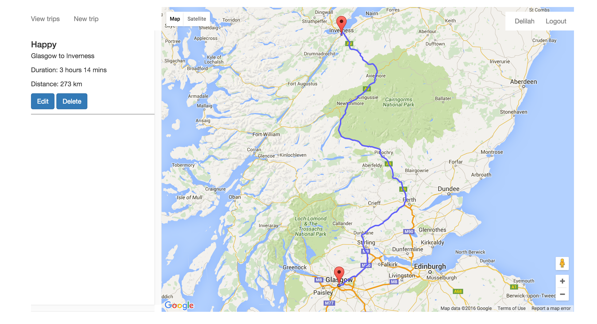

# RoadTrip

## The App

An app for planing road journeys. Users can store multiple trips by entering start and end points. They can subsequently view a route for each trip on a map, along with the distance and driving time.

## Technology

AngularJS, Express, NodeJS, Mongoose, Mongotron, Postman, Angular-google-maps, Google Maps, Google Places, Javascript, HTML and CSS.

## The approach

I planned using hand-drawn wireframes (in public directory) and wrote user stories on Pivotal Tracker split into six epics – Authentication, Journey, Map, Stopover, MVP and MVP2.

Planning to use a MEAN stack, I used a WDI solution code (ang-auth-solution-code) as my starting point. This included a passport local strategy, as well as front-end authentication, notably a currentUser service that could be injected into controllers.

I built three models – User, Trip and Stop – with cascading one-to-many relationships using references. I settled on one front-end controller to make the API calls. Into this I injected angular-google-maps to access data and services from Google Maps Javascript API and Google Places, which enabled me to render maps in the views using Angular directives. Its autocomplete input function enables users to search using Google Place objects.

## Challenges

Using Google Maps (GM) with AngularJS proved to be the biggest challenge. I spent a day trying to render GM only with Javascript, but found that Angular didn't like waiting for GM to load. 

Using ang-auth-solution-code enabled me to use Angular directives and overcome difficulties with asychronicity. However, it was still a challenge to integrate this into the controller, and work out which parts of GM docs and which part of the ang-auth-solution-code docs were relevant.

Decoding the GM route objects was also a challenge, notably getting the coordinates of a route to build a polyline.

Despite the difficulties I had integrating GM and GP with Angular, I enjoyed using GM and hope I will be able to develop the app to make use of more of its data.

## MVP 2

I plan to enable users:

* to choose places to stop from Google places and to plot these on their routes.

* to view only their own routes.

* to search for stopovers by distance and journey time form a given location.

* to prevent users from submitting a form unless all fields contain Google Places objects.

* to see the date each trip was created.

* a more refined bounds of the map in relation to the route.

* to be able to click on a location marker and view information in a pop-up window

## References

User stories: https://www.pivotaltracker.com/n/projects/1539935

Heroku URL: roadtrip-deploy.herokuapp.com